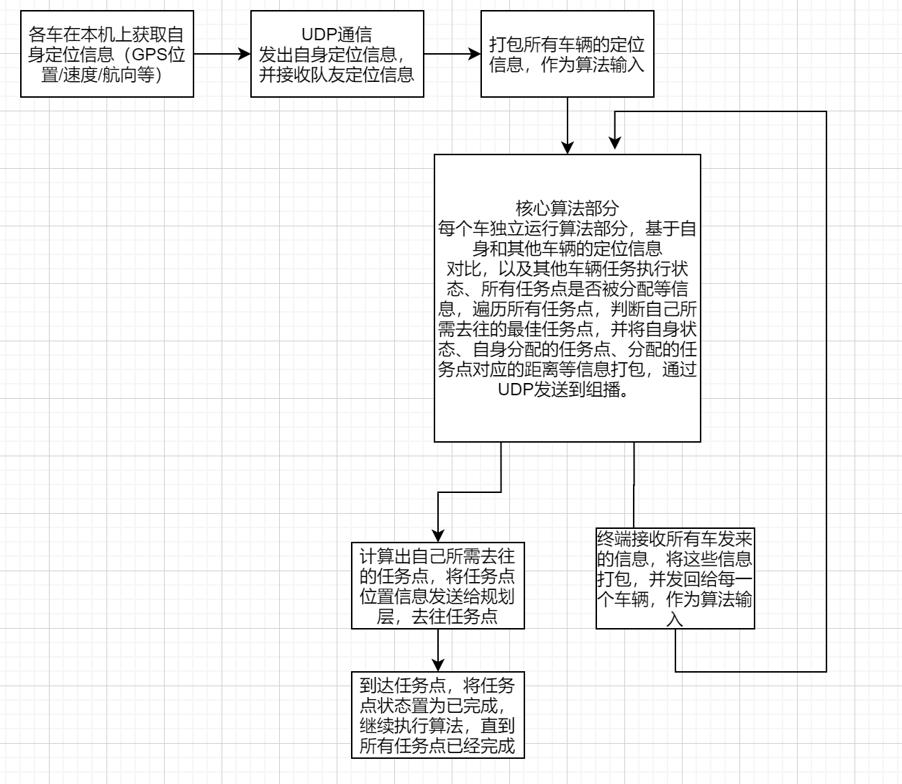
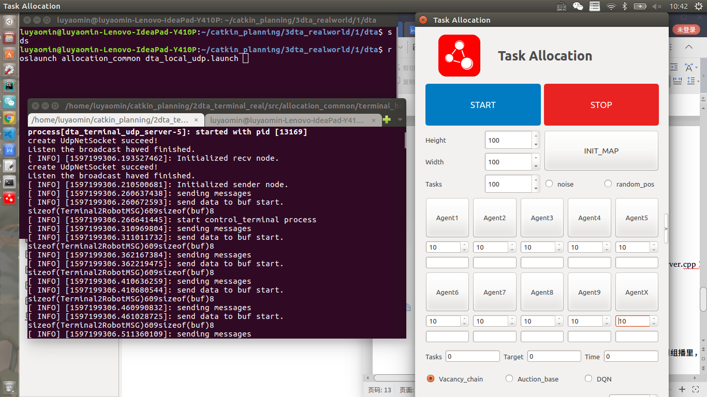

#### This project realizes the distributed task allocation algorithm based on market method and prediction method for multiple unmanned vehicles under ROS environment.

对于主机控制终端：

主机控制终端的作用是打开control_terminal界面，接收各车发送的本车位置和预分配任务点位置信息，并整合所有车的信息打包发送到组播udp里，由各车接收。同时，在主机控制终端的control_terminal界面里点击“INIT_MAP”和“START”，该命令随着所有车的信息一起打包下去给各车，以便启动所有车的计算任务点的程序。

具体步骤:

①启动roscore

②rosrun control_terminal control_terminal_node

③rosrun allocation_gazebo terminal_talker_node

④rosrun dta_terminal_udp dta_terminal_udp_server

⑤rosrun dta_terminal_udp dta_terminal_udp_client 

⑥点击control_terminal界面里的“INIT_MAP”和“START”按钮。

或者直接启动roslaunch allocation_common terminal_host.launch ，再点击control_terminal界面里的“INIT_MAP”和“START”按钮。

注意：

将主机电脑的网络和其他车辆的网络连在同一局域网下。

将主机电脑的ip在dta_terminal_udp包下的dta_terminal_server.cpp文件中的“char local_ip[32] = "192.168.10.xx";”改成主机的ip。

对于各车的分布式节点：

各车的分布式节点从感知的结果中读取本车的位置信息，并发送到组播里，从而各车能从组播里接收所有车辆的位置信息。

同时，各车的分布式节点根据所有车辆的位置信息以及控制终端来的其他车辆的预分配任务点信息，以一定频率周期地计算出本车的预分配任务点。

具体步骤：

①启动感知程序

发出gps信号，检查rostopic echo /gps_data话题是否有消息。

② roslaunch allocation_common real_pose.launch

③ rosrun task_allocation realworld_task_allocation_node1 

各车对应自己的node。

④ roslaunch allocation_common dta_local_udp.launch